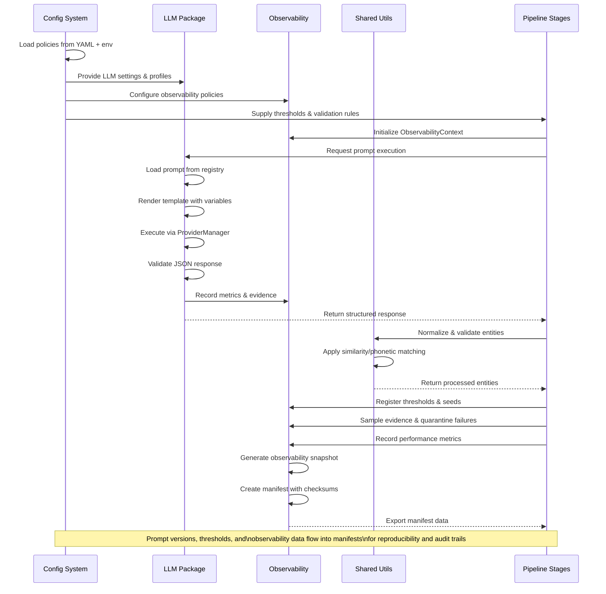

# Cross‑Cutting Interactions — Prompts, Thresholds, Manifests

Purpose
- Explain how prompts, thresholds, and manifests coordinate across LLM, Config/Policies, and Observability, and how data flows through the pipeline.

Scope
- LLM package (`src/taxonomy/llm/client.py`)
- Observability (`src/taxonomy/observability/context.py`, `src/taxonomy/observability/manifest.py`)
- Config (`src/taxonomy/config/settings.py`)
- Prompt registry (`prompts/registry.yaml`)

## Sequence Overview

## Prompt Resolution & Versioning
- Registry‑based lookup: `LLMClient.run(key, vars)` resolves `prompts/registry.yaml` to the active `{template, schema, version}`.
- Templates render with explicit variables; JSON‑only outputs are enforced.
- Active version is recorded under `manifest.prompts[{key}]` for audit and replay.

## Threshold Registration & Tracking
- Policy modules emit effective thresholds (e.g., S2 frequency minimums) through `observability.register_threshold(<name>, value)` before processing starts.
- All registered thresholds are exported in the observability snapshot and copied into the run manifest.

## Manifest Generation & Checksums
- `ObservabilityManifest.build_payload()` produces a deterministic JSON payload including counters, performance, prompts, thresholds, seeds, and evidence samples.
- Determinism utilities compute stable checksums (`stable_hash(canonical_json(payload))`).

## Policy‑Driven Coordination
- `Settings` merges defaults, YAML overlays, and env overrides to select the active LLM profile, observability options, and thresholds.
- LLM policy configures provider/model, retries, JSON modes; observability policy controls sampling and namespaces.

## Example: End‑to‑End Prompt Execution
1. Pipeline calls `llm.run("taxonomy.extract", {...})`.
2. Registry resolves `v3` → template + schema; ProviderManager executes with deterministic options.
3. JSONValidator enforces schema; on success, MetricsCollector emits `{ok, tokens, latency}`; on failure, item is quarantined with payload.
4. ObservabilityContext accumulates counters and evidence; snapshot includes `{prompts, thresholds, seeds}`.
5. Manifest exporter writes the payload with checksums to `output/runs/<run_id>/`.

## Example: Thresholds in S2
- Config: `thresholds.L2_min_inst=2, L3_min_src=3` via YAML or env (`TAXONOMY_POLICY__thresholds__L3_min_src=3`).
- Processor registers thresholds once; decisions (`kept` vs `dropped_insufficient_support`) increment counters and emit evidence with per‑item support stats.
- Manifest reflects effective thresholds and the counters used for downstream analysis.

## Entity Validation & Evidence
- Utilities normalize labels and compute similarity/phonetic features used by validation and disambiguation.
- Validation findings (rule/web/LLM) are summarized and sampled into evidence; no chain‑of‑thought is stored.

Related
- `docs/modules/llm.md`, `docs/modules/observability-reproducibility.md`, `docs/modules/config-policies.md`, `docs/modules/entities-core.md`, `docs/modules/utils-shared.md`

