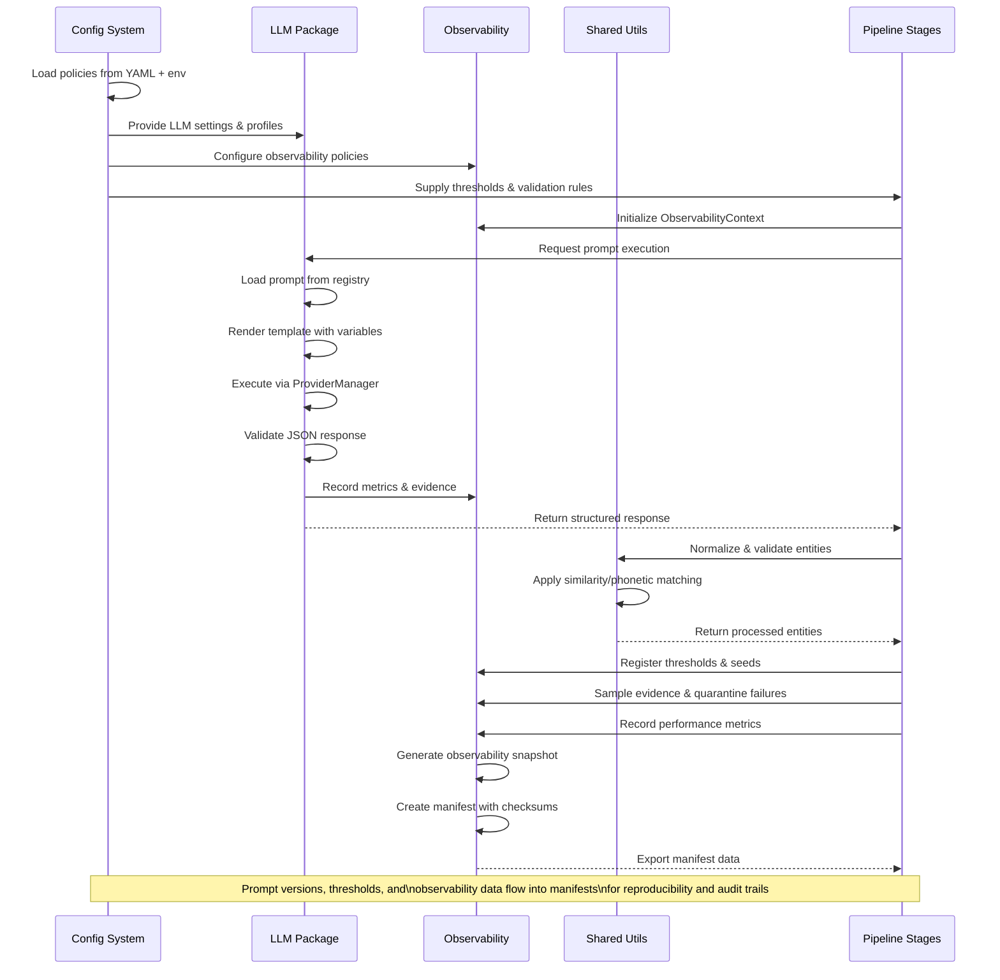

# Pipeline Core

## Quick Reference

Purpose
- Provide lightweight primitives to compose sequential S0–S3 steps with deterministic IO, checkpointing, and resume.

Key Classes
- `Pipeline`: Executes a list of `PipelineStep` instances with shared context and error handling.
- `PipelineStep` (protocol): Contract for step modules (S0–S3) to implement `run(context)` and emit artifacts.

Data Flow
- Input/outputs are plain dataclasses and file artifacts; each step reads prior artifacts and writes its own outputs and logs.
- Steps are ordered and checkpointed so runs can resume mid‑sequence without recomputation.

CLI Integration
- The CLI layer dispatches to concrete S0–S3 modules while reusing the `Pipeline` façade for consistent UX (`pipeline generate`, `pipeline run`).

Configuration
- All settings are resolved via `taxonomy.config` and injected into the pipeline context at construction.
- Determinism: LLM calls funnel through `taxonomy.llm` with temperature 0 and JSON mode.

Checkpoints & Resume
- Each step writes a checkpoint manifest with paths to emitted artifacts.
- On resume, `Pipeline` skips completed steps whose outputs are present and valid.

Example: Implement a Step
```python
from typing import Protocol
from taxonomy.pipeline import Pipeline, PipelineStep

class MyStep(PipelineStep):
    name = "Sx_example"
    def run(self, context) -> None:
        # read inputs from context, write artifacts, update context
        context.logger.info("running Sx")

pipeline = Pipeline(steps=[MyStep()])
pipeline.run(context)
```

Related Docs
- Detailed abstractions: this README
- CLI entry points: `src/taxonomy/cli/pipeline.py`

## Detailed Specification

### Pipeline Core Abstractions

This document specifies the core pipeline abstractions used across the taxonomy system. It focuses on the lightweight orchestrator pattern, the step protocol, and how checkpointing and resume semantics integrate with sequential execution.

#### Scope

- Runtime: `src/taxonomy/pipeline/__init__.py`
- Checkpoint integration: `src/taxonomy/orchestration/checkpoints.py`

#### Concepts

- `PipelineStep` (protocol): a unit of deterministic work with `name`, `run(ctx) -> StepResult`, and optional `resume(ctx) -> StepResult`.
- `Pipeline`: executes a list of `PipelineStep` instances in order, persisting step boundaries through the checkpoint manager.
- `StepResult`: dataclass-like structure capturing outputs, metrics, warnings, and next-step hints.
- `CheckpointManager`: provides idempotent boundaries for step completion and supports resuming from the last successful step.

#### Execution Semantics

- Steps run sequentially; a step starts only after the prior step has committed its checkpoint.
- On failure, the pipeline stops and records the failure with context in step metrics.
- On resume, the pipeline consults the `CheckpointManager` to skip any previously completed steps and continues from the first incomplete step.

#### Error Handling

- Steps must raise typed exceptions for irrecoverable conditions; transient issues are surfaced via `StepResult.warnings` and retried by the enclosing orchestrator when configured.
- All exceptions are annotated with step name and minimal repro metadata for later analysis.

#### Observability

- Each step logs: start/stop timestamps, input/output counts, token usage (when applicable), and derived metrics.
- The pipeline aggregates step metrics and emits a run manifest at completion.

#### Example: Defining and Running a Pipeline

```python
from taxonomy.pipeline import Pipeline, PipelineStep

class FetchStep(PipelineStep):
    name = "fetch"
    def run(self, ctx):
        items = ctx.source.read()
        ctx.checkpoints.save_step(self.name, count=len(items))
        return {"items": items}

class ProcessStep(PipelineStep):
    name = "process"
    def run(self, ctx):
        items = ctx.prev["items"]
        outputs = [x for x in items if x]
        ctx.checkpoints.save_step(self.name, produced=len(outputs))
        return {"outputs": outputs}

pipe = Pipeline([FetchStep(), ProcessStep()])
result = pipe.run(ctx)
```

#### Checkpoint Integration

- Steps call `CheckpointManager.save_step(step_name, **metadata)` after producing durable artifacts.
- `Pipeline.run()` reads `CheckpointManager.completed_steps()` and skips those steps when `ctx.resume=True`.
- Step outputs are written to phase-scoped artifact directories for reproducibility.

#### Contracts

- Inputs and outputs must be serializable (JSON or parquet where applicable).
- Steps are deterministic under fixed seed and configuration; concurrency must not reorder output semantics.

#### Related

- Orchestration phases: `src/taxonomy/orchestration/README.md`
- CLI integration: `src/taxonomy/cli/README.md`

### Pipeline Data Flow

This document traces artifacts across S0–S3 and assembly, defining the semantic contracts and example JSON payloads for each type.

#### Scope

- Entities: `src/taxonomy/entities/core.py`
- Reference: `docs/logic-spec.md`

#### Artifact Types

- `PageSnapshot` (input): raw page content and metadata.
- `SourceRecord` (S0 output): segmented, filtered text units with provenance.
- `Candidate` (S1 output): normalized tokens with counts and optional parents.
- `Concept` (S3 output): verified candidates with confidence and reasons.
- `Hierarchy` (final): assembled, validated graph with manifest.

#### Example Payloads

```json
// PageSnapshot
{"snapshot_id":"s1","url":"https://ex.org","content":"...","lang":"en"}

// SourceRecord
{"record_id":"s1-0","text":"Intro...","metadata":{"lang":"en","snapshot_id":"s1"}}

// Candidate
{"token":"python","level":1,"count":3,"parents":["programming-language"]}

// Concept
{"token":"python","level":1,"confidence":0.94,"reasons":["passes-rules","llm-positive"]}

// Hierarchy (simplified)
{"nodes":[{"id":"programming-language"},{"id":"python","parent":"programming-language"}]}
```

#### Serialization & Layout

- JSONL for streaming artifacts, parquet where configured for analytics.
- File naming: phase- and level-scoped prefixes; deterministic sharding for large outputs.

#### Contracts

- Required fields must be present at each handoff; optional metadata is preserved when available.
- Canonical forms (ASCII, casing) are maintained after S1 normalization.

#### Related

- S0–S3 and assembly module details: see `src/taxonomy/pipeline/s0_raw_extraction/README.md`, `src/taxonomy/pipeline/s1_extraction_normalization/README.md`, `src/taxonomy/pipeline/s2_frequency_filtering/README.md`, `src/taxonomy/pipeline/s3_token_verification/README.md`, and `src/taxonomy/pipeline/hierarchy_assembly/README.md`.

### Cross‑Cutting Interactions — Prompts, Thresholds, Manifests

Purpose
- Explain how prompts, thresholds, and manifests coordinate across LLM, Config/Policies, and Observability, and how data flows through the pipeline.

Scope
- LLM package (`src/taxonomy/llm/client.py`)
- Observability (`src/taxonomy/observability/context.py`, `src/taxonomy/observability/manifest.py`)
- Config (`src/taxonomy/config/settings.py`)
- Prompt registry (`prompts/registry.yaml`)

#### Sequence Overview



#### Prompt Resolution & Versioning
- Registry‑based lookup: `LLMClient.run(key, vars)` resolves `prompts/registry.yaml` to the active `{template, schema, version}`.
- Templates render with explicit variables; JSON‑only outputs are enforced.
- Active version is recorded under `manifest.prompts[{key}]` for audit and replay.

#### Threshold Registration & Tracking
- Policy modules emit effective thresholds (e.g., S2 frequency minimums) through `observability.register_threshold(<name>, value)` before processing starts.
- All registered thresholds are exported in the observability snapshot and copied into the run manifest.

#### Manifest Generation & Checksums
- `ObservabilityManifest.build_payload()` produces a deterministic JSON payload including counters, performance, prompts, thresholds, seeds, and evidence samples.
- Determinism utilities compute stable checksums (`stable_hash(canonical_json(payload))`).

#### Policy‑Driven Coordination
- `Settings` merges defaults, YAML overlays, and env overrides to select the active LLM profile, observability options, and thresholds.
- LLM policy configures provider/model, retries, JSON modes; observability policy controls sampling and namespaces.

#### Example: End‑to‑End Prompt Execution
1. Pipeline calls `llm.run("taxonomy.extract", {...})`.
2. Registry resolves `v3` → template + schema; ProviderManager executes with deterministic options.
3. JSONValidator enforces schema; on success, MetricsCollector emits `{ok, tokens, latency}`; on failure, item is quarantined with payload.
4. ObservabilityContext accumulates counters and evidence; snapshot includes `{prompts, thresholds, seeds}`.
5. Manifest exporter writes the payload with checksums to `output/runs/<run_id>/`.

#### Example: Thresholds in S2
- Config: `thresholds.L2_min_inst=2, L3_min_src=3` via YAML or env (`TAXONOMY_POLICY__thresholds__L3_min_src=3`).
- Processor registers thresholds once; decisions (`kept` vs `dropped_insufficient_support`) increment counters and emit evidence with per‑item support stats.
- Manifest reflects effective thresholds and the counters used for downstream analysis.

#### Entity Validation & Evidence
- Utilities normalize labels and compute similarity/phonetic features used by validation and disambiguation.
- Validation findings (rule/web/LLM) are summarized and sampled into evidence; no chain‑of‑thought is stored.

Related
- `src/taxonomy/llm/README.md`, `src/taxonomy/observability/README.md`, `src/taxonomy/config/README.md`, `src/taxonomy/entities/README.md`, `src/taxonomy/utils/README.md`

